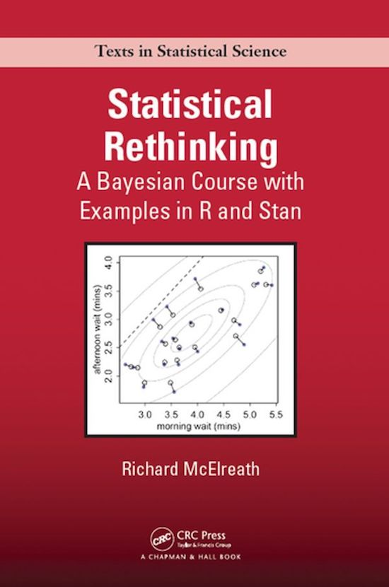
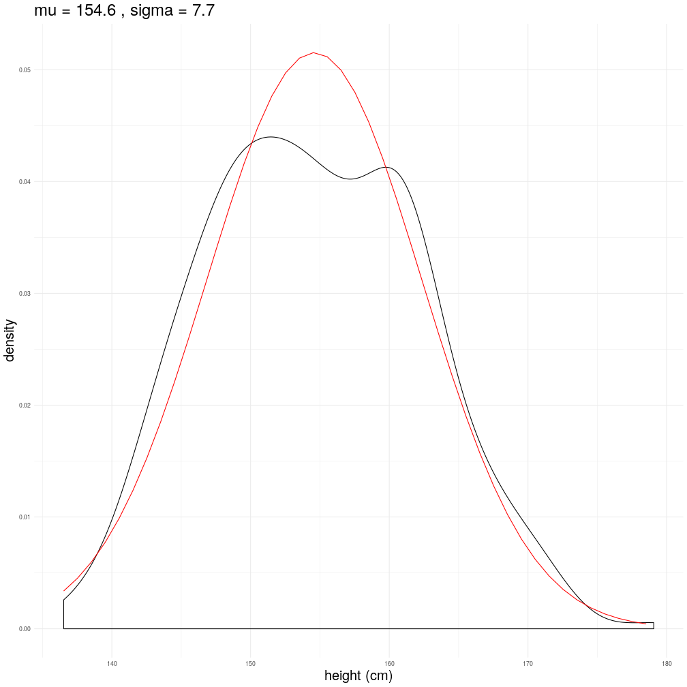
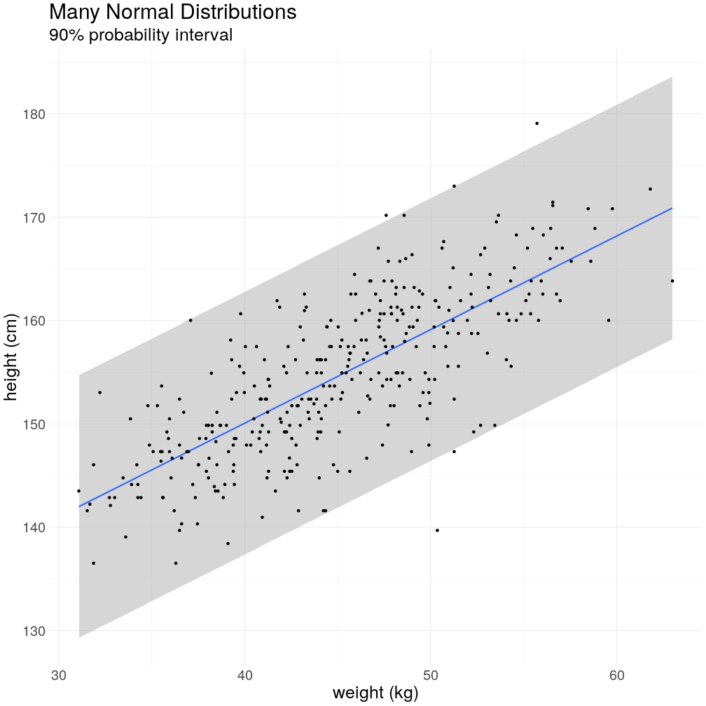
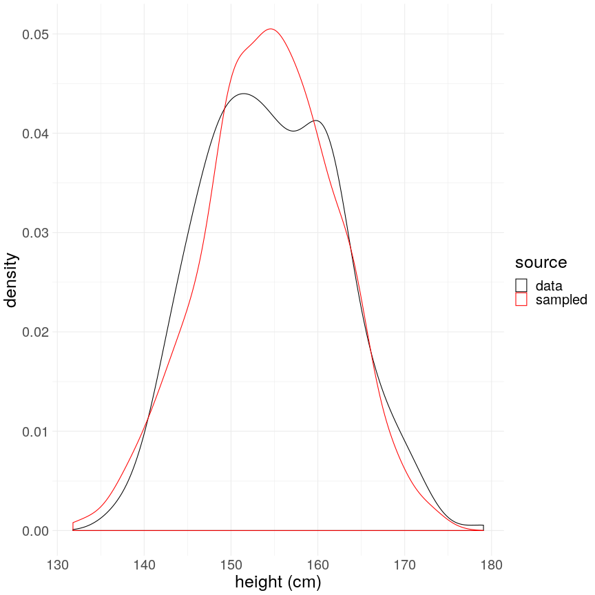
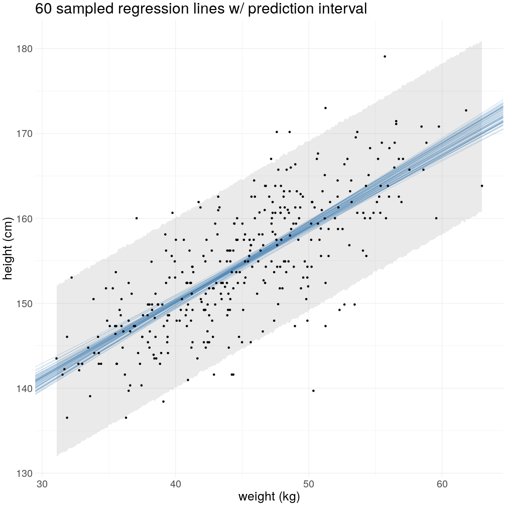
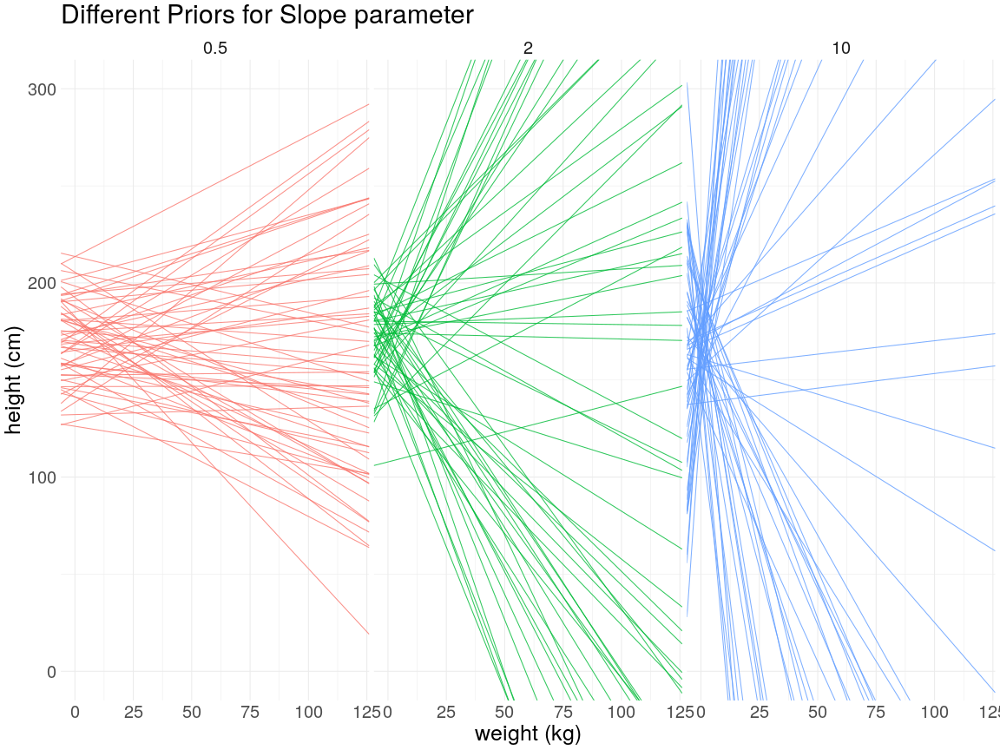
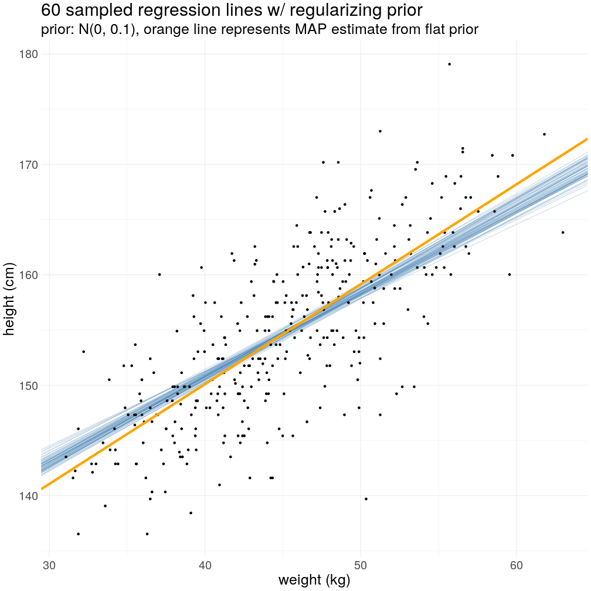

<style>

/* slide titles */
.reveal h3 {
  font-size: 2.5em
}

/* normal text */
.reveal section p {
  font-size: 2em
}

/* ordered and unordered list styles */
.reveal ul, 
.reveal ol {
    font-size: 2em;
    line-height: 1.2;
}

/* code */
.reveal section pre code {
    font-size: 1.8em;
}
</style>

Rethinking Regression
========================================================
author: Keith Williams
date: 2020-02-27
autosize: true  
transition: none


Motivation
========================================================
left: 70%
<br>
For a long time, a trusty interview question:  

*"Explain to me linear regression as if I was a business manager....  
...Describe to me an alternative method and its tradeoffs."*  
***

Motivation
========================================================
left: 70%  
<br>
For a long time, a trusty interview question:  

*"Explain to me linear regression as if I was a business manager....  
...Describe to me an alternative method and its tradeoffs."*  
***


What I hope you get out of this
========================================================
<br>
- A deeper understanding of regression models.  
- An introduction to Bayesian Inference.  
- A desire to learn more.  

OLS, an old story
========================================================
# $$ y_i = \beta_0 + \beta_1 x_i + \epsilon_i $$  

OLS, an old story
========================================================
# $$ y_i = \beta_0 + \beta_1 x_i + \epsilon_i $$  
$\epsilon$ is doing a lot of work!  
# $$ \hat{y}_i = \beta_0 + \beta_1 x_i $$
Assumptions aren't obvious. e.g. how is $Y$ distributed?  
Are we going to learn $\epsilon$?  

Rewritten as Bayesian
========================================================
# $$ y_i \sim \mathcal{N}(\mu, \sigma) $$  
Assumption: $Y$ has a mean and finite variance.  

The Normal distribution makes the fewest assumptions about the shape of the distribution, i.e. it is a maximum entropy distribution.  

This is the *data generating distribution* and we will call it the *likelihood function*

Rewritten as Bayesian
========================================================
# $$ y_i \sim \mathcal{N}(\mu, \sigma) $$  
# $$ \mu = \beta_0 $$

Rewrite $\mu$ in terms of $\beta$  

Rewritten as Bayesian
========================================================
# $$ y_i \sim \mathcal{N}(\mu_i, \sigma) $$  
# $$ \mu_i = \beta_0 + \beta_1 x_i $$  

Add in a predictor, every value of $X$ gets its own mean $\mu$  

Rewritten as Bayesian
========================================================
<br>
Using $\epsilon$ notation.  
# $$ y_i = \mu_i + \epsilon_i $$  
# $$ \mu_i = \beta_0 + \beta_1 x_i $$  
# $$ \epsilon_i \sim \mathcal{N}(0, \sigma) $$
***
Say "goodbye" to $\epsilon$, we're left with a more general form.  
# $$ y_i \sim \mathcal{N}(\mu_i, \sigma) $$  
# $$ \mu_i = \beta_0 + \beta_1 x_i $$  

An example with code
========================================================


```r
data(Howell1, package = "rethinking")
adult_heights <- filter(Howell1, age >= 18)
glimpse(adult_heights)
```

```
Observations: 352
Variables: 4
$ height <dbl> 151.7650, 139.7000, 136.5250, 156.8450, 145.4150, 163.830…
$ weight <dbl> 47.82561, 36.48581, 31.86484, 53.04191, 41.27687, 62.9925…
$ age    <dbl> 63.0, 63.0, 65.0, 41.0, 51.0, 35.0, 32.0, 27.0, 19.0, 54.…
$ male   <int> 1, 0, 0, 1, 0, 1, 0, 1, 0, 1, 0, 1, 0, 0, 0, 1, 1, 0, 1, …
```

# Model:  
# $$ height_i \sim \mathcal{N}(\mu_i, \sigma) $$  
# $$ \mu_i = \beta_0 + \beta_1 weight_i $$  

An example with code
========================================================
left: 40%
<br>
Intercept Only Model:  

```r
# get summary statistics of height
min_height <- min(adult_heights$height)
max_height <- max(adult_heights$height)
mean_height <- mean(adult_heights$height)
sd_height <- sd(adult_heights$height)

estimated_heights <- tibble(
  height = seq(min_height, max_height)) %>% 
  mutate(
    # here's the important bit
    density = dnorm(
      x = height, 
      mean = mean_height, 
      sd = sd_height)
  )

ggplot(adult_heights, aes(x = height)) + 
  geom_density() +
  geom_line(
    data=estimated_heights, 
    aes(y = density), 
    color = "red"
  ) +
  theme(text = element_text(size = 25))
```
***
$height_i \sim \mathcal{N}(154.6, 7.7)$  


An example with code
========================================================
Add weight as a predictor:  
$$ height_i \sim \mathcal{N}(\mu_i, 7.7) $$  
$$ \mu_i = 114 + 0.90 weight_i $$  

```r
adult_heights %>% 
  mutate(
    # mu is a function of weight
    mu = beta[1] + beta[2] * weight,
    # use sigma to create a prediction interval
    lower = estimate - 1.64 * sd_height,
    upper = estimate + 1.64 * sd_height
  ) %>%
  ggplot(aes(x = weight)) + 
  geom_smooth(aes(ymin = lower, ymax = upper, y = mu), stat = "identity") + 
  geom_point(aes(y = height))
```
***



The Target of Bayesian Inference
========================================================
left: 60%
<br>
$$ P(\mu, \sigma | heights) $$

```r
sampled_heights <- numeric(length = 1000)
for (i in 1:1000) {
  # sample a value for mu and sigma
  sample_mu <- sample(probability_mu, 1)
  sample_sigma <- sample(probability_sigma, 1)
  
  # generate data according to our likelihood function
  sampled_heights[i] <- rnorm(1, sample_mu, sample_sigma)
}

adult_heights %>% 
  select(height) %>% 
  mutate(src = "data") %>% 
  bind_rows(tibble(height = sampled_heights, src = "sampled")) %>% 
  ggplot(aes(x = height, color = src)) + 
  geom_density()
```
***


Bayes' Theorem  
========================================================
<br>
The target of inference: $P(\mu, \sigma|height)$  

$$ P(\mu, \sigma|height) = \frac{\prod_i\mathcal{N}(h_i|\mu, \sigma)P(\mu, \sigma)}{\int\int\prod_i\mathcal{N}(h_i|\mu, \sigma)P(\mu, \sigma) d\mu d\sigma} $$  

Bayes' Theorem  
========================================================
<br>
The target of inference: $P(\mu, \sigma|height)$  

$$ P(\mu, \sigma|height) = \frac{\prod_i\mathcal{N}(h_i|\mu, \sigma)P(\mu, \sigma)}{\int\int\prod_i\mathcal{N}(h_i|\mu, \sigma)P(\mu, \sigma) d\mu d\sigma} $$  
$$ height_i \sim \mathcal{N}(\mu, \sigma) $$  
$$ \mu \sim \mathcal{N}(170, 20) $$  
$$ \sigma \sim Uniform(0, 50) $$

Bayes' Theorem  
========================================================
<br>
The target of inference: $P(\beta_0, \beta_1, \sigma|height, weight)$  

$$ P(\beta_0, \beta_1, \sigma|height, weight) \propto \prod_i\mathcal{N}(h_i|\beta_0, \beta_1, weight_i, \sigma)P(\beta_0, \beta_1, \sigma) $$  
$$ height_i \sim \mathcal{N}(\mu_i, \sigma) $$  
$$ \mu_i = \beta_0 + \beta_1 weight_i $$  
$$ \beta_0 \sim \mathcal{N}(170, 20) $$  
$$ \beta_1 \sim \mathcal{N}(0, 10) $$  
$$ \sigma \sim Uniform(0, 50) $$  

Bayes' Theorm
========================================================
Calculating the Posterior 

```r
# data structure for holding joint probability for any (mu, sigma) tuple
posterior_probability <- data.frame(mu = c(), sigma = c(), unscaled_probability = c())

# update posterior
for (mu in all_mus) {
  for (sigma in all_sigmas) {
    prior_prob_mu <- dnorm(mu, 170, 20)
    prior_prob_sigma <- dunif(sigma, 0, 50)
    likelihood <- product(
      for (height in adult_heights$height) {
        dnorm(height, mu, sigma)
      }
    )
    unscaled_probability <- likelihood * prior_prob_mu * prior_prob_sigma
    new_row <- data.frame(mu, sigma, unscaled_probability)
    posterior_probability <- bind_rows(posterior_probability, new_row)
  }
}

# scale probabilities such that sum(probabilty) = 1
mutate(posterior_probability, probability = unscaled_probability / sum(unscaled_probability))
```

Back to heights, conveying uncertainty
========================================================
<br>
1. sample a $\beta_0$ and a $\beta_1$ from the posterior.  
2. Plot the line.  
3. Repeat to convey uncertainty.  

***




Hidden Assumptions  
========================================================
What are the priors for OLS?  
# $$ height_i = \beta_0 + \beta_1 weight_i + \epsilon $$  

Hidden Assumptions  
========================================================
What are the priors for OLS?  
# $$ height_i = \beta_0 + \beta_1 weight_i + \epsilon $$  
Flat priors, we can do better.  

Priors as regularization  
========================================================
left: 51%
$$ height_i \sim \mathcal{N}(\mu_i, \sigma) $$  
$$ \mu_i = \beta_0 + \beta_1 weight_i $$  
$$ \beta_0 \sim \mathcal{N}(170, 20) $$  
$$ \beta_1 \sim \mathcal{N}(0, 10) $$  
$$ \sigma \sim Uniform(0, 50) $$  

```r
sample_betas <- function(slope_sd, n_lines) {
  tibble(
    intercept = rnorm(n_lines, mean = 170, sd = 20),
    slope = rnorm(n_lines, mean = 0, sd = slope_sd),
    slope_sd = slope_sd
  )
}

purrr::map_df(c(0.5, 2, 10), 
              ~sample_betas(.x, n_lines = 60)) %>% 
  ggplot(aes(intercept = intercept, slope = slope)) + 
  geom_abline() +
  facet_wrap(~slope_sd)
```

***


Priors as regularization  
========================================================
<br>
$$ P(\beta_0, \beta_1, \sigma|height, weight) \propto \prod_i\mathcal{N}(h_i|\beta_0, \beta_1, weight_i, \sigma)P(\beta_0, \beta_1, \sigma) $$  
***
 

Priors as regularization  
========================================================
left: 55%

<br>
$$ P(\beta_0, \beta_1, \sigma|height, weight) \propto \prod_i\mathcal{N}(h_i|\beta_0, \beta_1, weight_i, \sigma)P(\beta_0, \beta_1, \sigma) $$  
$$ height_i \sim \mathcal{N}(\mu_i, \sigma) $$  
$$ \mu_i = \beta_0 + \beta_1 weight_i $$  
$$ \beta_0 \sim \mathcal{N}(170, 20) $$  
$$ \beta_1 \sim \mathcal{N}(0, 0.1) $$  
$$ \sigma \sim Uniform(0, 50) $$  
***
<br>
<br>
<br>


Summarize  
========================================================
- Writing Linear models as a likelihood, and modeling paramaters as a linear model is a more general form that makes assumptions explicit.  
- The target of Bayesian regression is a posterior probability on all estimated parameters.  
- Posterior probabilites are learned as a product of the likelihood of your data and prior probabilities on the parameters of the likelihood.  
- Priors can be used to encode your domain knowledge and to regularlize estimates.  

# What we didn't cover:  
- How to use software to estimate the posterior.  
- Changing the likelihood function (e.g Binomial(n, p) and other "GLM"s).  
